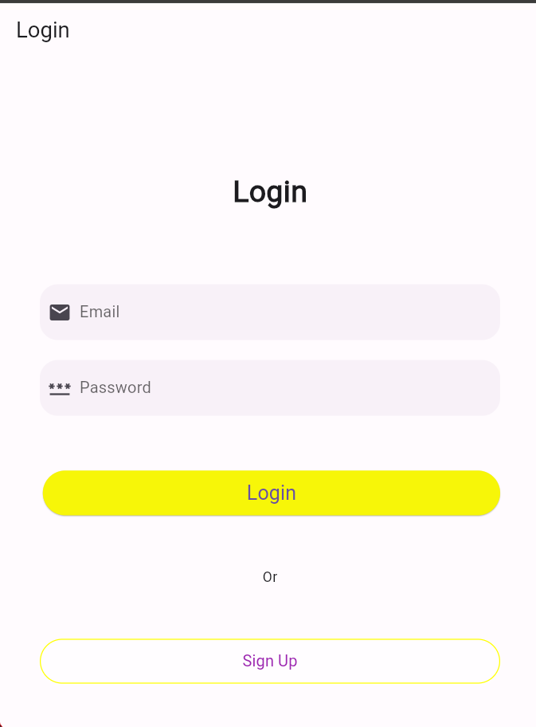

# PEMROGRAMAN MOBILE PROJECT
## Nama : I Gede Satya Ariya Putra Sangjaya
## NIM : 2205551040
__________________________________________________
### How to run this program
1. Download or clone this repository
2. Go place on whereever in your computer
3. Open this file at Visual studio code or android studio
4. Type 'cd .'
5. Type 'flutter run'
6. Enjoy
__________________________________________________
## This is what login page looks like

## Login Page
#### This is login page looks like when you start to run flutter project, the generator will run the main.dart and just execute the login_page.dart for a sec
__________________________________________________

## Login Page with type a email and password instead
#### This is login page looks like when you type a email and password insteat to colloumn that i just command on the Class of LocalDatabase at login_page.dart, this is command that i mean

#### After i type the command, i can just call it when user was put the right email and password [TRUE] and if wrong [FALSE] it will refresh the page

__________________________________________________

## Dashboard view
#### When user type the right email and password, user will directly bring in to dashboard page. In dashboard page user can yout interact with 1 buttom [LOGOUT] thats button will directly bring users back to login page. this is the code that i command to

__________________________________________________
[Sign Up Page](lib/signup_page.dart)
## Sign up view
#### At login page, when user press the [SIgn Up] button, they just directly moved to Sign Up page, and the photo was view from Sign Up page. im not putting some command or button thats spesial to this page

# Thankyou
